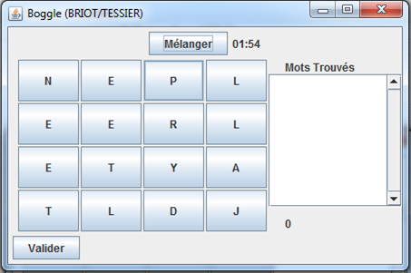
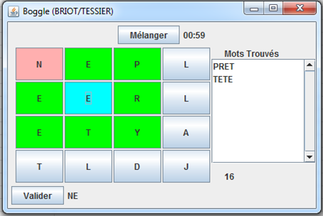
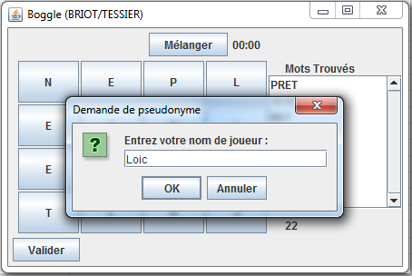
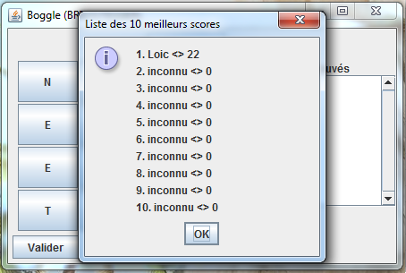

#Boggle

##Description

Cette application a été réalisée en travaux pratiques de deuxième année à 3iL
Il s’agit d’un jeu base sur le boggle, un jeu de lettres ou il faut trouver le plus de mots possibles à partir d’une grille de lettres en un temps limite. 

##Informations

Ce projet a été codé en java avec swing et se joue à la souris.

##Screenshots

This software has been written by:

*Loïc TESSIER 

*Vincent BRIOT
